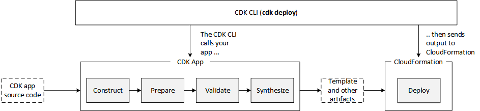

## What is the AWS Cloud Development Kit (CDK)?
The AWS Cloud Development Kit (CDK) is an open-source software development framework for defining cloud infrastructure as code with modern programming languages and deploying it through AWS CloudFormation. It allows developers to use familiar programming languages to define their cloud infrastructure, such as TypeScript, JavaScript, Python, Java, and C#. This makes it easier to develop, deploy, and manage cloud applications.

The CDK can be used to develop a wide variety of cloud applications. It is particularly well-suited for developing applications that require complex or highly-structured infrastructure. The CDK can also be used to automate the deployment and management of cloud infrastructure, which can save time and effort.

Once the infrastructure is defined, the CDK can be used to deploy it to AWS. This is done by using the CDK Toolkit, which is a command-line tool that can be used to synthesize AWS CloudFormation templates and deploy them to AWS.

## Concept

Here are some of the key concepts in AWS CDK constructs:

1. `Construct`: A fundamental building block of AWS CDK applications that represents a cloud resource, such as an EC2 instance, S3 bucket, or a Lambda function. A construct can be a simple resource or a collection of resources that work together to provide a specific functionality.
2. `Stack`: A stack is a collection of AWS resources that are created and managed together as a single unit. A stack can contain any number of constructs and other AWS resources.
3. `Resource`: An AWS resource is a piece of infrastructure in the AWS cloud, such as an EC2 instance, S3 bucket, or a Lambda function. Resources can be created, updated, and deleted through AWS CloudFormation.
4. `Property`: A property is a setting or configuration option for an AWS resource, such as the size of an EC2 instance or the number of replicas in an ECS service.
5. `Dependency`: A dependency is a relationship between two AWS resources where one resource depends on another. For example, an EC2 instance may depend on an S3 bucket for data storage.
6. `Tag`: A tag is a key-value pair that can be added to AWS resources to help identify and organize them.
7. `Parameter`: A parameter is a value that can be passed into a stack or a construct to customize its behavior. Parameters are defined in the AWS CloudFormation template and can be used to make a stack or construct more flexible and reusable.
8. `Output`: An output is a value that is generated by a stack or a construct and can be used by other stacks or constructs. Outputs are defined in the AWS CloudFormation template and can be used to share information between stacks and constructs.

Read more on CDK concept [here](https://docs.aws.amazon.com/cdk/v2/guide/)

## How does it work?
CDK works by providing a set of high-level object-oriented libraries that represent AWS services, allowing developers to define their infrastructure using code. The CDK then generates AWS CloudFormation templates from this code, which can be deployed to create the required resources. This allows developers to use familiar programming languages and tools to create infrastructure, and simplifies the process of resource creation and management.

### CDK APP LIFE CYCLE

The following diagram shows the phases that the AWS CDK goes through when you call the `cdk deploy`. This command deploys the resources that your app defines.

An AWS CDK app goes through the following phases in its lifecycle.

1. **Construction** (or Initialization):
During the synthesis stage of the AWS CDK app life cycle, the app is transformed into an AWS CloudFormation template. The CDK constructs are translated into AWS CloudFormation resources and parameters, which can be deployed to the AWS cloud.

2. **Preparation**: 
All constructs that have implemented the `prepare` method participate in a final round of modifications to set up their final state. The preparation phase happens automatically and usually does not require user intervention. It is not recommended to use the `prepare` hook unless necessary, and users should be cautious when mutating the construct tree during this phase as the order of operations can impact behavior. There is no feedback provided to the user during this phase.

3. **Validation**
All constructs that have implemented the validate method can validate themselves to ensure that they're in a state that will correctly deploy. You will get notified of any validation failures that happen during this phase. Generally, we recommend performing validation as soon as possible (usually as soon as you get some input) and throwing exceptions as early as possible. Performing validation early improves diagnosability as stack traces will be more accurate, and ensures that your code can continue to execute safely.

4. **Synthesis**:
This is the final stage of the execution of your AWS CDK app. It's triggered by a call to app.synth(), and it traverses the construct tree and invokes the synthesize method on all constructs. Constructs that implement synthesize can participate in synthesis and emit deployment artifacts to the resulting cloud assembly. These artifacts include AWS CloudFormation templates, AWS Lambda application bundles, file and Docker image assets, and other deployment artifacts. Cloud assemblies describes the output of this phase. In most cases, you won't need to implement the synthesize method.

5. **Deployment**:
In this phase, the AWS CDK Toolkit takes the deployment artifacts cloud assembly produced by the synthesis phase and deploys it to an AWS environment. It uploads assets to Amazon S3 and Amazon ECR, or wherever they need to go. Then, it starts an AWS CloudFormation deployment to deploy the application and create the resources.

## How much does AWS CDK Cost to use?
There is no additional charge to use AWS CDK. You pay for the AWS resources created using CDK in the same manner as if you created them manually on an AWS Console. You only pay for the AWS resources that you use. There are no minimum fees and no required upfront commitments.

## How do I install the AWS CDK Tool Kit?
You can install AWS CDK on Linux, Mac, or Windows. To get started, visit the [installation documentation](https://aws.amazon.com/getting-started/guides/setup-cdk/module-two/).

## Benefits of using AWS CDK.

Here are some of the benefits of using the AWS CDK:

- It uses familiar programming languages. This makes it easier for developers to learn and use the CDK.
- It provides a high-level abstraction of AWS resources. This makes it easier to define and manage complex infrastructure.
- It can be used to automate the deployment and management of cloud infrastructure. This can save time and effort.
- It is open source. This means that it is free to use and modify.

Read more about AWS CDK [here](https://docs.aws.amazon.com/cdk)